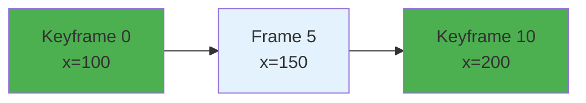

# Annotation Model

FOVEA uses bounding box sequences as the foundation for all video annotations. Understanding how sequences, keyframes, and interpolation work is essential for efficient annotation.

## Core Concept: Bounding Box Sequences

All bounding box annotations in FOVEA are sequences, even if they only appear in a single frame. This unified model simplifies the system and handles both static and moving objects consistently.

### Why Sequences Matter

Traditional frame-by-frame annotation requires drawing boxes on every frame where an object appears. For a 100-frame segment, this means drawing 100 boxes. Bounding box sequences reduce this to 3-5 keyframes, with the system generating the remaining 95-97 frames automatically. This reduces annotation time by 60-95% based on industry benchmarks.

### Sequence Structure

A bounding box sequence contains:

- **Keyframes**: Frames where you explicitly set the box position and size
- **Interpolated frames**: Frames where the box is automatically calculated between keyframes
- **Interpolation segments**: Configuration for how to transition between keyframes
- **Visibility ranges**: Time periods when the object is visible in the video
- **Metadata**: Tracking source, confidence scores, labels

## Keyframes

Keyframes are user-defined control points where you explicitly position and size the bounding box. The system marks these frames and uses them as anchors for interpolation.

### Creating Keyframes

1. **Initial keyframe**: Drawing a bounding box creates the first keyframe
2. **Additional keyframes**: Press `K` at any frame to add a keyframe
3. **Converting interpolated frames**: Click a corner handle on an interpolated box to convert it to a keyframe

### Keyframe Properties

Each keyframe stores:
- Frame number
- Bounding box coordinates (x, y, width, height)
- Keyframe flag (`isKeyframe: true`)
- Optional confidence score (for tracking-based annotations)

### Minimum Requirements

Sequences with motion require at least 2 keyframes. Single-keyframe sequences represent static objects that appear on only one frame.

## Interpolation

Interpolation is the automatic generation of bounding boxes for frames between keyframes. The system calculates box positions and sizes based on the interpolation type you select.

### Interpolation Types

#### Linear (Default)

Linear interpolation creates constant-velocity motion between keyframes. The box moves at a steady rate from one keyframe to the next.



**Use for**: Objects moving at constant speed in straight lines.

#### Bezier

Bezier interpolation uses control points to create smooth curves with acceleration and deceleration. The system applies cubic Bezier mathematics to transition smoothly between keyframes.

**Use for**: Natural motion with smooth starts and stops, curved paths.

#### Ease-In

Gradual acceleration from rest. The box starts slow and speeds up as it approaches the next keyframe.

**Use for**: Objects starting to move from a stationary position.

#### Ease-Out

Gradual deceleration to rest. The box moves fast initially and slows down as it approaches the next keyframe.

**Use for**: Objects coming to a stop.

#### Ease-In-Out

Smooth acceleration and deceleration. The box starts slow, speeds up in the middle, then slows down again.

**Use for**: Most natural human and animal motion.

#### Hold

No interpolation. The box stays in the same position until reaching the next keyframe, where it jumps instantly.

**Use for**: Objects that remain stationary then teleport, or for creating distinct pose keyframes.

### Interpolation Math

The system interpolates each box property (x, y, width, height) independently using the formula:

```
value(t) = start_value + (end_value - start_value) * f(t)
```

Where:
- `t` is the normalized time (0 to 1) between keyframes
- `f(t)` is the interpolation function (linear, bezier, easing)

For bezier interpolation, `f(t)` evaluates a cubic Bezier curve with configurable control points.

## Visibility Ranges

Objects do not always remain visible throughout a video. Visibility ranges mark when an object is present in the frame.

### Use Cases

- **Objects entering frame**: Person walks into view
- **Objects leaving frame**: Car drives out of sight
- **Occlusion**: Object temporarily hidden behind another object
- **Discontiguous sequences**: Object appears, disappears, then reappears

### Creating Visibility Ranges

1. **Mark visibility end**: Press `V` at the frame where the object leaves
2. **Mark visibility start**: Advance to the frame where it returns, press `V` again
3. **Using in/out points**: Press `[` to mark in-point, `]` to mark out-point

### Constraints

- Keyframes can only exist in visible ranges
- Interpolation skips invisible ranges
- Each sequence requires at least one visible range

## Tracking Integration

Bounding box sequences integrate with automated tracking models. When you run object tracking, the system generates sequence candidates with tracking metadata.

### Tracking Metadata

- **Track ID**: Identifier from the tracking model
- **Tracking source**: Model used (SAMURAI, SAM2Long, ByteTrack, etc.)
- **Confidence**: Overall tracking quality score
- **Per-frame confidence**: Individual frame confidence scores

### Workflow

1. Run tracking on a video segment
2. System generates sequence candidates
3. Review candidates with confidence visualization
4. Accept high-confidence tracks
5. Refine accepted tracks by adding or adjusting keyframes

Accepted tracks become standard sequences that you can edit like manually created ones.

## Data Model

### BoundingBox Structure

```typescript
interface BoundingBox {
  x: number              // Left edge (pixels from left)
  y: number              // Top edge (pixels from top)
  width: number          // Width in pixels
  height: number         // Height in pixels
  frameNumber: number    // Frame index (0-based)
  isKeyframe?: boolean   // True for user-defined keyframes
  confidence?: number    // Optional confidence score (0-1)
}
```

### InterpolationSegment Structure

```typescript
interface InterpolationSegment {
  startFrame: number     // First frame of segment
  endFrame: number       // Last frame of segment
  type: InterpolationType  // linear, bezier, ease-in, etc.

  // For bezier interpolation
  controlPoints?: {
    x?: BezierControlPoint[]
    y?: BezierControlPoint[]
    width?: BezierControlPoint[]
    height?: BezierControlPoint[]
  }
}
```

### BoundingBoxSequence Structure

```typescript
interface BoundingBoxSequence {
  boxes: BoundingBox[]   // All boxes (keyframes + interpolated)
  interpolationSegments: InterpolationSegment[]
  visibilityRanges: Array<{
    startFrame: number
    endFrame: number
    visible: boolean
  }>
  trackId?: string       // Link to tracking result
  trackingSource?: string  // Tracking model used
  trackingConfidence?: number
  totalFrames: number
  keyframeCount: number
  interpolatedFrameCount: number
}
```

## Performance Optimization

### Lazy Evaluation

The system uses lazy evaluation for interpolation. Instead of pre-computing all frames when you create keyframes, it calculates boxes on demand when you seek to a frame.

### Caching

Computed interpolated boxes are cached in memory. When you seek to a frame multiple times, the system returns the cached value instantly.

### Cache Invalidation

When you modify a keyframe, the system invalidates only the affected interpolation segments. This minimizes recalculation and maintains smooth editing performance.

## Efficiency Gains

### Example: Annotating a Walking Person

**Frame-by-frame approach**:
- Video: 300 frames (10 seconds at 30 fps)
- Actions: Draw 300 boxes
- Time: ~30 minutes (6 seconds per frame)

**Keyframe approach**:
- Video: 300 frames
- Actions: Draw 5 keyframes
- Time: ~3 minutes (36 seconds per keyframe + review)
- **Reduction**: 90% fewer manual actions

### When to Add Keyframes

Add keyframes when:
- Object changes direction
- Object changes speed (acceleration/deceleration)
- Object changes size significantly
- Object rotates or changes pose
- Current interpolation deviates from actual position

## Comparison to Other Tools

Most professional annotation tools (CVAT, Labelbox, V7 Labs) use similar keyframe interpolation systems. FOVEA's implementation provides:

- Bezier curves for complex motion (like After Effects)
- Visibility ranges for discontiguous sequences
- Direct integration with automated tracking
- Per-property interpolation control
- Parametric motion functions for physics-based animation

## Next Steps

- [Bounding Box Sequences User Guide](../user-guides/annotation/bounding-box-sequences.md) - Practical keyframe workflows
- [Automated Tracking](../user-guides/annotation/automated-tracking.md) - Bootstrap sequences with AI
- [Export and Import](../user-guides/data-management/exporting-data.md) - Share sequences between systems
- [Keyboard Shortcuts](../reference/keyboard-shortcuts.md) - Efficient annotation with shortcuts
