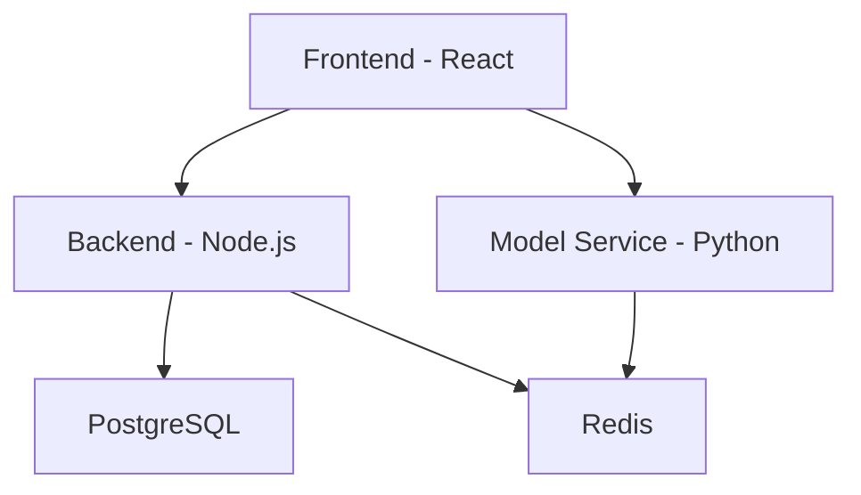

# Architecture

Fovea follows a three-tier architecture with separate frontend, backend, and model service layers.

## System Overview

## Components

### Frontend
React-based single-page application for video annotation and ontology management.

### Backend
Node.js API server with Fastify framework, handling data persistence and job orchestration.

### Model Service
Python-based AI inference service for video summarization, object detection, and tracking.

## Data Flow

User interactions in the frontend trigger API calls to the backend, which persists data to PostgreSQL and queues AI tasks in Redis for the model service to process.

## Next Steps

- Learn about [Docker profiles](./docker-profiles.md)
- Understand the [annotation model](./annotation-model.md)
