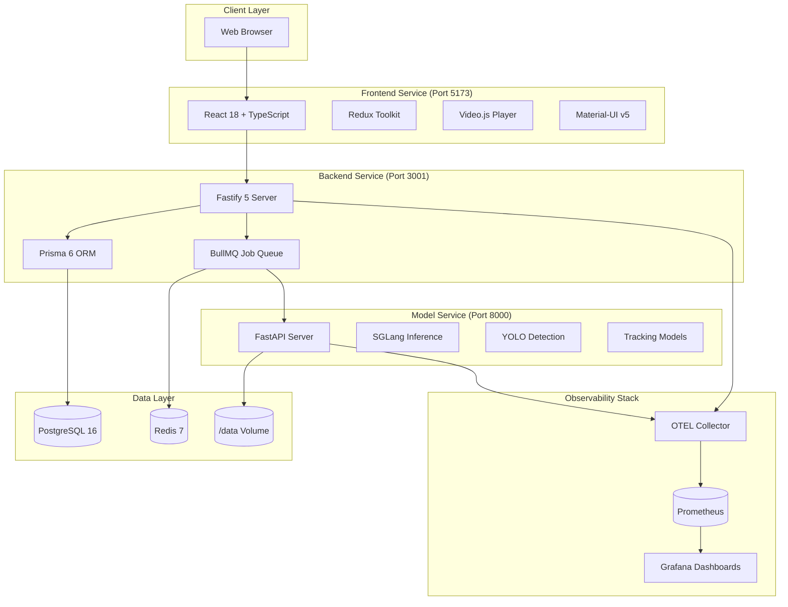

# Architecture

FOVEA uses a microservices architecture with separate frontend, backend, and model service layers connected through REST APIs and message queues.

## System Architecture

## Components

### Frontend

The frontend is a single-page application built with React 18 and TypeScript 5.3+. Key technologies include:

- **React 18 + TypeScript 5.3+**: Component-based UI with type safety
- **Redux Toolkit**: Centralized state management for ontology, world state, and annotations
- **Video.js v8**: Video playback with frame-accurate seeking
- **Material-UI v5**: UI components with emotion-based styling
- **TanStack Query v5**: Server state caching and synchronization
- **Leaflet + react-leaflet**: Map interactions for location editing

The frontend runs on port 5173 during development and communicates with the backend via REST API.

### Backend

The backend is a Node.js 22 LTS server using the Fastify 5 framework. Key technologies include:

- **Fastify 5**: High-performance REST API server
- **Prisma 6**: Type-safe ORM for PostgreSQL with migrations
- **BullMQ 5**: Job queue for asynchronous AI tasks
- **TypeBox**: Schema validation with Fastify type provider
- **OpenTelemetry**: Distributed tracing and metrics

The backend serves the REST API on port 3001, persists data to PostgreSQL, and queues long-running jobs (video summarization, object tracking) to Redis for the model service to process.

### Model Service

The model service is a Python 3.12 application using FastAPI 0.110+ for AI inference. Key technologies include:

- **FastAPI 0.110+**: High-performance async API server
- **SGLang 0.4+**: Primary inference engine for VLMs and LLMs
- **vLLM 0.6+**: Fallback inference engine
- **PyTorch 2.5+**: Deep learning framework
- **Transformers 4.47+**: Pretrained model loading
- **Ultralytics**: YOLO object detection models
- **Supervision**: Object tracking algorithms

The model service runs on port 8000 and processes jobs from Redis, including video summarization, object detection, object tracking, and ontology augmentation.

### Data Layer

The data layer consists of persistent storage and caching:

- **PostgreSQL 16**: Primary database with pgvector extension for embedding storage
- **Redis 7**: Job queue backend and caching layer
- **/data Volume**: Mounted directory containing video files served to the frontend

### Observability Stack

The observability stack provides monitoring and debugging capabilities:

- **OpenTelemetry Collector**: Aggregates traces and metrics from all services (port 4318)
- **Prometheus**: Time-series metrics storage (port 9090)
- **Grafana**: Visualization dashboards (port 3002, login: admin/admin)

## Service Interactions

### Frontend to Backend

The frontend calls the backend REST API for CRUD operations on personas, ontologies, world objects, and annotations. API calls use Axios with automatic retry and error handling.

### Backend to Model Service (via BullMQ)

For long-running AI tasks, the backend submits jobs to BullMQ:

1. User clicks "Run Tracking" in the frontend
2. Frontend sends POST request to backend `/api/tracking` endpoint
3. Backend creates a BullMQ job and returns job ID to frontend
4. BullMQ worker picks up the job from Redis
5. Worker calls model service `/track` endpoint
6. Model service processes the video and returns results
7. Worker stores results in database
8. Frontend polls for job completion via `/api/jobs/:id`

### Telemetry Flow

All services emit OpenTelemetry traces and metrics:

1. Services send telemetry to OTEL Collector (localhost:4318)
2. OTEL Collector aggregates and exports to Prometheus
3. Prometheus stores time-series metrics
4. Grafana queries Prometheus for dashboard visualization

## Port Assignments

| Service | Port | URL | Purpose |
|---------|------|-----|---------|
| Frontend | 5173 | http://localhost:5173 | React development server (Vite) |
| Backend | 3001 | http://localhost:3001 | REST API server (Fastify) |
| Model Service | 8000 | http://localhost:8000 | AI inference API (FastAPI) |
| PostgreSQL | 5432 | localhost:5432 | Database server |
| Redis | 6379 | localhost:6379 | Job queue and cache |
| Prometheus | 9090 | http://localhost:9090 | Metrics storage and queries |
| Grafana | 3002 | http://localhost:3002 | Metrics dashboards (admin/admin) |
| Bull Board | 3001 | http://localhost:3001/admin/queues | Job queue monitoring UI |
| OTEL Collector | 4318 | localhost:4318 | Telemetry ingestion (HTTP) |
| OTEL Collector | 4317 | localhost:4317 | Telemetry ingestion (gRPC) |

## Next Steps

- Learn about [Deployment Overview](../deployment/overview.md)
- Understand [Service Architecture](../deployment/service-architecture.md)
- Explore [Observability](./observability.md)
