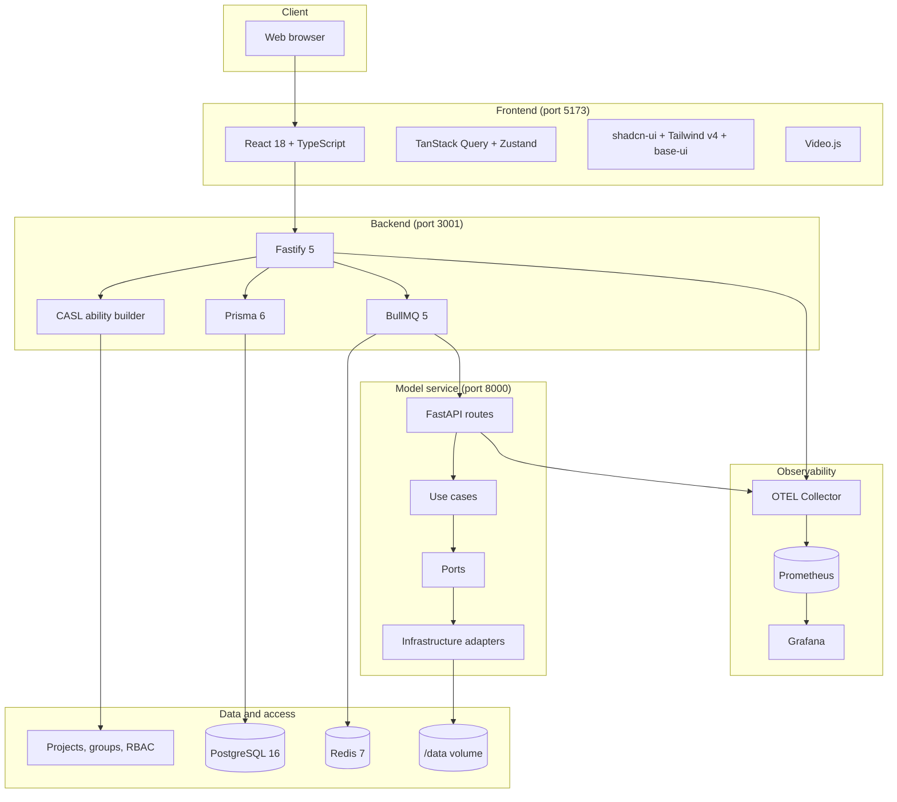

# Architecture

Fovea is a three-service application: a React frontend, a Fastify backend, and a Python model service. PostgreSQL persists relational data, Redis backs the BullMQ job queue and a cache layer, and an OpenTelemetry pipeline emits traces and metrics from every service.

## System diagram

```mermaid
graph TB
    subgraph "Client"
        Browser[Web browser]
    end

    subgraph "Frontend (port 5173)"
        React[React 18 + TypeScript]
        State[TanStack Query + Zustand]
        UI[shadcn-ui + Tailwind v4 + base-ui]
        Player[Video.js]
    end

    subgraph "Backend (port 3001)"
        Fastify[Fastify 5]
        Prisma[Prisma 6]
        BullMQ[BullMQ 5]
        CASL[CASL ability builder]
    end

    subgraph "Model service (port 8000)"
        FastAPI[FastAPI routes]
        UseCases[Use cases]
        Ports[Ports]
        Adapters[Infrastructure adapters]
    end

    subgraph "Data and access"
        Postgres[(PostgreSQL 16)]
        Redis[(Redis 7)]
        Videos[(/data volume)]
        Authorization[Projects, groups, RBAC]
    end

    subgraph "Observability"
        OTEL[OTEL Collector]
        Prom[(Prometheus)]
        Grafana[Grafana]
    end

    Browser --> React
    React --> Fastify
    Fastify --> CASL
    CASL --> Authorization
    Fastify --> Prisma
    Fastify --> BullMQ
    Prisma --> Postgres
    BullMQ --> Redis
    BullMQ --> FastAPI
    FastAPI --> UseCases
    UseCases --> Ports
    Ports --> Adapters
    Adapters --> Videos
    Fastify --> OTEL
    FastAPI --> OTEL
    OTEL --> Prom
    Prom --> Grafana
```

The "Authorization" layer sits between authenticated users and every project-scoped resource. All data routes filter results through CASL `accessibleBy()` queries, and project membership is the gate for video and project-scoped persona, world state, annotation, summary, and claim access.

## Components

### Frontend

The frontend is a Vite-built React 18 + TypeScript 5 single-page application.

- **shadcn-ui** components composed on **Tailwind CSS v4** design tokens
- **base-ui** primitives for low-level interactive elements
- **Lucide** icon set (barrel-exported)
- **TanStack Query v5** for server state with optimistic updates
- **Zustand** for client UI state (selections, dialogs, drawing modes)
- **Video.js v8** for frame-accurate video playback
- **Leaflet** for location editing

The frontend dev server runs on port 5173. Component tests use Vitest + Testing Library against the shadcn DOM structure.

### Backend

The backend is a Fastify 5 server on Node 22 LTS.

- **Prisma 6** for PostgreSQL access (repository pattern via `VideoRepository` and friends)
- **BullMQ 5** for asynchronous summarization, detection, and tracking jobs
- **TypeBox** schemas for request validation through the Fastify type provider
- **CASL** with `@casl/prisma` for RBAC; per-user ability cache with explicit invalidation
- **OpenTelemetry** spans on every route and RBAC check
- `services/system-config-propagator.ts` pushes admin SystemConfig writes (and replays them on startup) to the model service over `/api/admin/reconfigure`

### Model service

The model service uses Clean Architecture layers under `model-service/src/`:

- **`domain/`**: entities, value objects, exception hierarchy, types
- **`application/`**: use cases (`summarize_video`, `detect_objects`, `track_objects`, `extract_claims`, `synthesize_summary`, `augment_ontology`, `fuse_modalities`), service interfaces, DTOs, and ports (`inbound`, `outbound`)
- **`infrastructure/`**: FastAPI inbound adapters; outbound adapters for VLM, LLM, detection, tracking, audio, video, persistence, and external API routing
- **`main.py`**: dependency injection container that wires use cases to adapters at startup

Inference engines are pluggable through loader factories. The same task can dispatch to Transformers, SGLang, vLLM, ONNX Runtime, or llama.cpp depending on the model entry's `framework` field. See [Model Service Overview](../model-service/overview.md).

### Data layer

- **PostgreSQL 16** for relational data (with pgvector for embeddings)
- **Redis 7** for the BullMQ queue and `CacheService`
- **`/data` volume** for video files served via range requests

### Observability

- **OTEL Collector** on ports 4317 (gRPC) and 4318 (HTTP)
- **Prometheus** on port 9090
- **Grafana** on port 3002 with RBAC, queue, and inference dashboards

## Service interactions

### Frontend to backend

REST calls over Axios. TanStack Query manages cache invalidation; mutations use optimistic updates where the server is single-source-of-truth (preferences, persona pins, system config).

### Backend to model service

Synchronous detection, tracking, and reconfigure calls go directly. Long-running jobs (summarization, claim extraction, claim synthesis, ontology augmentation, video tracking) flow through BullMQ:

1. Frontend POSTs the request to the backend.
2. Backend creates a BullMQ job and returns the job id.
3. A worker picks up the job, calls the model service, and persists the result.
4. Frontend polls `/api/jobs/:id` (or subscribes through TanStack Query) for status.

Generation and audio overrides from persona pins and user preferences are merged client-side, attached to the summarize request, and forwarded as `generation_overrides` / `audio_overrides` in the model service payload.

### Telemetry flow

Every service exports OTLP traces and metrics to the OTEL Collector. The collector forwards metrics to Prometheus; Grafana queries Prometheus for dashboards (RBAC checks, queue depth, model inference latency, audio vendor latency, etc.).

## Authorization and access control

The backend implements role-based access control with [CASL](https://casl.js.org/). On each authenticated request the server:

1. Reads the cached RolePermission matrix (TTL fallback, explicit invalidation on edit).
2. Collects the user's roles across the system, group, and project scopes.
3. Builds a CASL ability instance keyed on `userId` (per-user ability cache with explicit invalidation on membership add/remove, role change, and project deletion).
4. Adds ownership baseline rules using per-model ownership fields: `Persona`/`WorldState.userId`, `Annotation.createdByUserId`, `VideoSummary`/`Claim`/`UserGroup.createdBy`, `Project.ownerUserId`.
5. Hands the ability to route handlers, which use `accessibleBy()` for list filters and `subject()` checks for instance-level reads and writes.

System administrators bypass all checks. All other access is governed by the matrix plus ownership rules. Re-shares cannot exceed the received permission level (a `read_only` recipient cannot re-share as `forkable`). See [Projects, Groups, and RBAC](./projects-groups.md).

## Port assignments

| Service | Port | Purpose |
|---------|------|---------|
| Frontend | 5173 | Vite dev server |
| Backend | 3001 | REST API (Fastify) |
| Model Service | 8000 | Inference API (FastAPI) |
| PostgreSQL | 5432 | Database |
| Redis | 6379 | Queue and cache |
| Prometheus | 9090 | Metrics storage |
| Grafana | 3002 | Dashboards |
| Bull Board | 3001 | `/admin/queues` job UI |
| OTEL Collector | 4317 / 4318 | gRPC / HTTP OTLP |

## Next steps

- [Projects, Groups, and RBAC](./projects-groups.md)
- [Model Service Overview](../model-service/overview.md)
- [Deployment Overview](../deployment/overview.md)
- [Observability](./observability.md)
