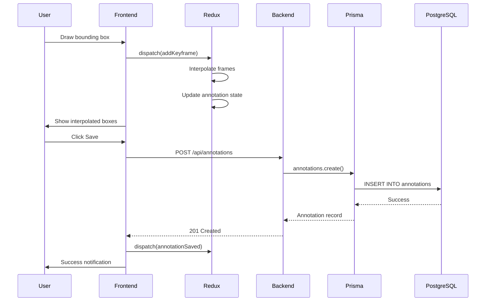
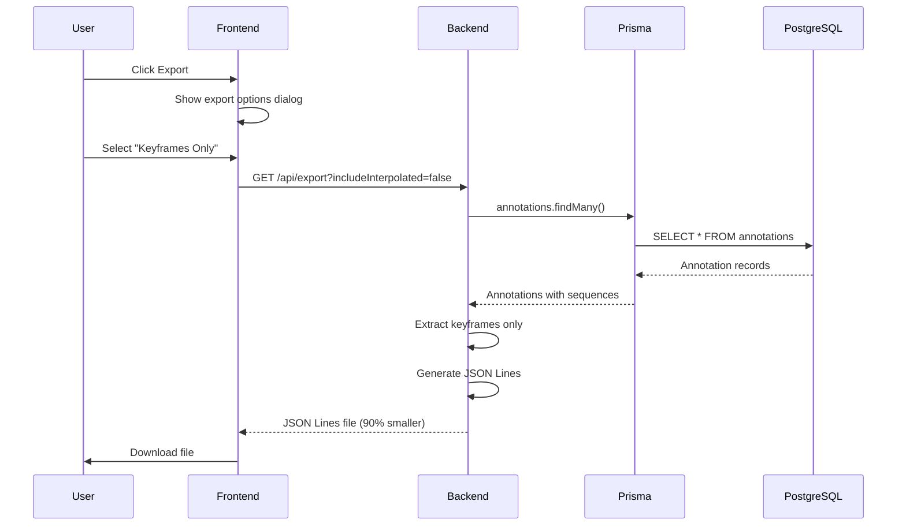
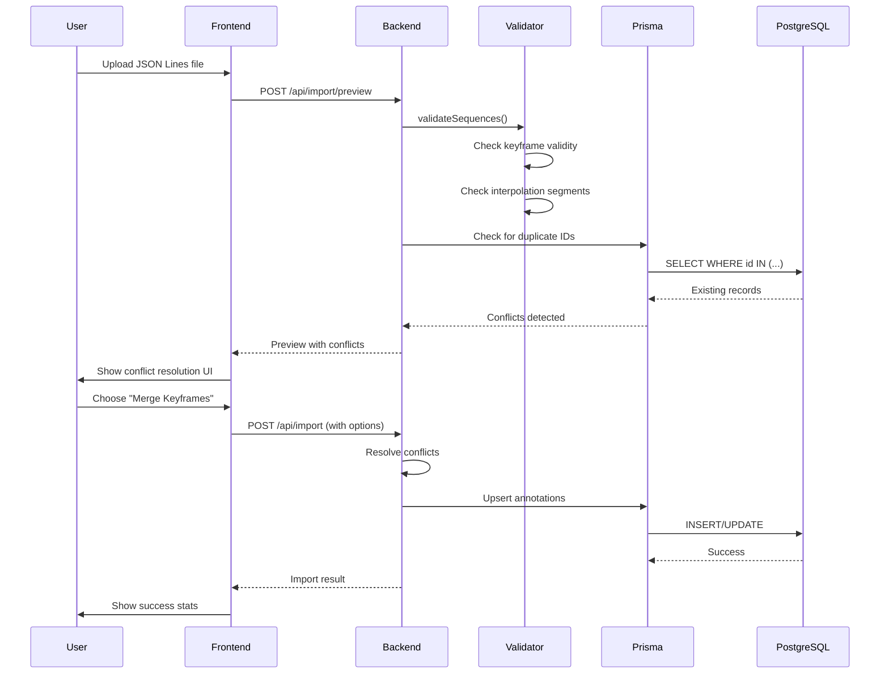
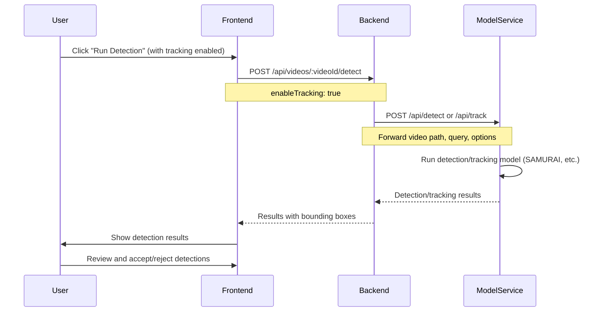

# Data Flow

This page describes how data moves through FOVEA during common operations using sequence diagrams.

## Annotation Creation Flow

When a user creates an annotation, the data flows from the frontend through Redux to the backend and PostgreSQL.

**Flow Steps**:

1. User draws bounding box in video player
2. Frontend dispatches Redux action to add keyframe
3. Redux interpolation engine generates frames between keyframes
4. Frontend displays interpolated boxes in real-time
5. User clicks Save button
6. Frontend sends POST request to backend API
7. Backend creates annotation via Prisma ORM
8. Prisma inserts record into PostgreSQL
9. Backend returns created annotation to frontend
10. Frontend updates Redux state and shows success notification

## Export Flow

Export generates JSON Lines files containing ontologies, world objects, and annotations.

**Flow Steps**:

1. User clicks Export button in toolbar
2. Frontend displays export options dialog
3. User selects export mode (keyframes-only or fully interpolated)
4. Frontend sends GET request to backend with options
5. Backend queries annotations from database via Prisma
6. For keyframes-only mode, backend extracts keyframes and interpolation configs
7. Backend generates JSON Lines format (one object per line)
8. Frontend receives file and triggers browser download
9. User saves file to local filesystem

**Export Optimization**: Keyframes-only mode produces files 90% smaller than fully interpolated mode while preserving all annotation intent.

## Import Flow with Conflict Resolution

Import validates JSON Lines files and resolves conflicts before persisting data.

**Flow Steps**:

1. User drags JSON Lines file to import dialog
2. Frontend sends preview request to backend
3. Backend validates sequence structure (keyframes, interpolation, visibility)
4. Backend checks for duplicate IDs in database
5. Backend returns preview with conflict warnings
6. User reviews conflicts and chooses resolution strategy
7. Frontend sends import request with resolution options
8. Backend applies conflict resolution (skip, replace, merge)
9. Backend performs database upsert via Prisma
10. Frontend displays import results (items imported, skipped, errors)

**Conflict Types**:
- Duplicate sequence IDs
- Overlapping frame ranges
- Invalid interpolation configurations
- Missing persona or video references

## Object Detection and Tracking Flow

Object detection and tracking requests are forwarded directly to the model service.

**Flow Steps**:

1. User clicks "Run Detection" button in detection dialog
2. User optionally enables tracking in dialog options
3. Frontend sends POST request to backend `/api/videos/:videoId/detect`
4. Backend validates request and forwards to model service
5. Model service runs detection (YOLO-World-v2, GroundingDINO, etc.)
6. If tracking enabled, model service runs tracking (SAMURAI, SAM2.1, etc.)
7. Model service returns bounding boxes with confidence scores
8. Backend forwards results to frontend
9. Frontend displays bounding boxes on video
10. User reviews results and accepts as annotations or rejects

**Available Models**:
- **Detection**: YOLO-World-v2 (default), GroundingDINO 1.5, OWLv2, Florence-2
- **Tracking**: SAMURAI (default), SAM2Long, SAM2.1, YOLO11n-seg

## Next Steps

- Understand the [Annotation Workflow](../user-guides/annotation/bounding-box-sequences.md)
- Learn about [Exporting Data](../user-guides/data-management/exporting-data.md)
- Learn about [Importing Data](../user-guides/data-management/importing-data.md)
- Explore [Observability](./observability.md) for monitoring data flows
