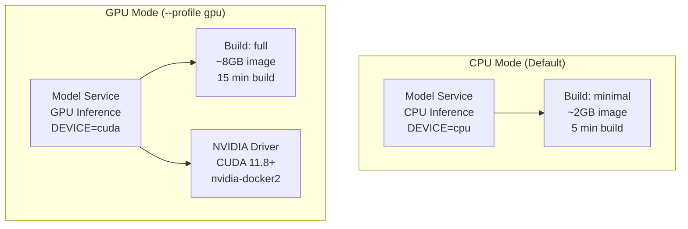

# Docker Profiles

FOVEA uses Docker Compose profiles to support both CPU and GPU deployments from a single configuration file.

## Introduction

Docker Compose profiles enable explicit deployment choices without maintaining separate configuration files:
- **Default profile**: CPU mode (works on any system)
- **GPU profile**: Requires NVIDIA GPU and nvidia-docker2
- **Build modes**: minimal (fast builds) vs full (all inference engines)

## CPU vs GPU Comparison



## Performance Comparison

| Operation | CPU Minimal | CPU Full | GPU Minimal | GPU Full |
|-----------|-------------|----------|-------------|----------|
| Video Summarization (30s clip) | 45s | 40s | 8s | 5s |
| Object Detection (1 frame) | 1.2s | 1.0s | 0.2s | 0.15s |
| Object Tracking (100 frames) | 25s | 20s | 5s | 3s |
| Cold Start (model loading) | 10s | 15s | 20s | 30s |
| Memory Usage | 2GB | 3GB | 6GB | 10GB |

These benchmarks use a sample video with 1920x1080 resolution at 30 FPS. Actual performance varies based on hardware, video complexity, and model configuration.

## Build Modes

### Minimal Build

The minimal build mode (`BUILD_MODE=minimal`) includes base dependencies only:

- Faster build times (5 minutes vs 15 minutes)
- Smaller image size (2GB vs 8GB)
- Suitable for CI/CD pipelines and local development
- Includes basic inference capabilities

### Full Build

The full build mode (`BUILD_MODE=full`) includes all inference engines:

- SGLang inference engine (optimized for VLMs and LLMs)
- vLLM fallback inference engine
- All object detection models (YOLO variants)
- All tracking models (SAMURAI, SAM2Long, ByteTrack)
- Longer build times but better performance

## When to Use Each Mode

### CPU + Minimal

Use for:
- CI/CD pipelines (fast builds, low resource usage)
- Local development without GPU
- Testing core functionality without AI features
- Systems where model inference is not required

### CPU + Full

Use for:
- Production CPU deployments (cloud servers without GPUs)
- Testing inference engines before GPU deployment
- Development with full AI features on CPU-only machines

### GPU + Minimal

Use for:
- Quick GPU testing
- Prototyping with minimal dependencies
- Resource-constrained GPU environments

### GPU + Full (Recommended for Production)

Use for:
- Production deployments with NVIDIA GPUs
- Maximum AI inference performance
- Complete feature set with all models available

## Commands

### Start CPU Mode (Default)

```bash
docker compose up
```

Starts all services in CPU mode. The model service uses CPU inference.

### Start GPU Mode

```bash
docker compose --profile gpu up
```

Starts services with GPU support. Requires NVIDIA GPU and nvidia-docker2 installed.

### Build with Specific Mode

```bash
# Minimal build (fast, smaller image)
docker compose build --build-arg BUILD_MODE=minimal

# Full build (slow, larger image, all engines)
docker compose build --build-arg BUILD_MODE=full
```

### Verify GPU Access

After starting GPU mode, verify GPU is accessible:

```bash
docker compose exec model-service nvidia-smi
```

This command should display NVIDIA GPU information. If it fails, check NVIDIA driver and nvidia-docker2 installation.

## Next Steps

- Learn about [Prerequisites](../deployment/prerequisites.md)
- Understand [CPU Mode Deployment](../deployment/cpu-mode.md)
- Understand [GPU Mode Deployment](../deployment/gpu-mode.md)
- Read about [Build Modes](../deployment/build-modes.md)
