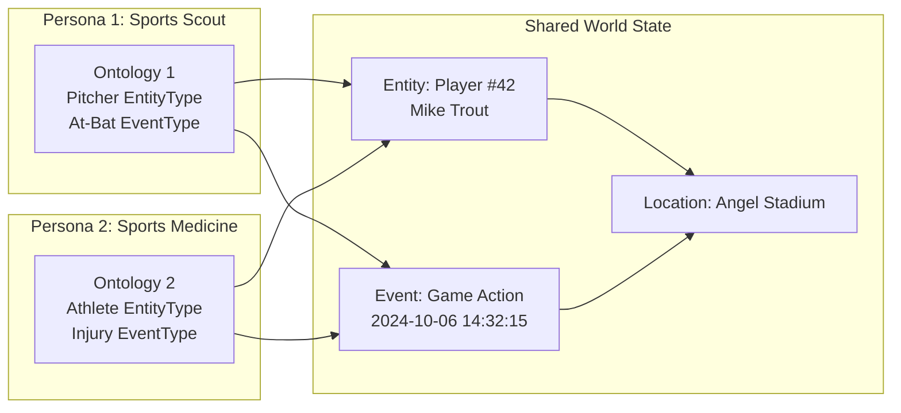

# Personas

A persona represents an analyst or analytical perspective in FOVEA. Each persona maintains its own ontology (type definitions) while working with shared world objects (instances).

## Introduction

The persona-based ontology system enables multiple analysts to interpret the same events differently. Each persona has its own ontology containing type definitions (EntityType, EventType, RoleType, RelationType), while the world state (Entity, Event, Time, Location instances) is shared across all personas.

This separation enables multi-perspective analysis where different analysts can assign different types to the same real-world objects through their own interpretive frameworks.

## Baseball Game Example

Consider three personas analyzing the same baseball game video:

### Sports Scout Persona

Focuses on player performance metrics.

**EntityTypes**:
- **Pitcher**: Attributes include pitch velocity (mph), accuracy (%), pitch count
- **Batter**: Attributes include batting average, power (exit velocity), on-base percentage

**EventTypes**:
- **Pitch**: Attributes include pitch type (fastball, curveball, slider), speed, location
- **At-Bat**: Attributes include result (hit, out, walk), pitch count, RBI
- **Strikeout**: Attributes include strikeout type (swinging, looking, called)

**Focus**: Evaluating player talent and performance trends

### Sports Medicine Persona

Focuses on biomechanics and injury prevention.

**EntityTypes**:
- **Athlete**: Attributes include injury history, recovery status, workload (pitches thrown)
- **Body Part**: Attributes include joint type (shoulder, elbow), range of motion, fatigue level

**EventTypes**:
- **Throwing Motion**: Attributes include arm angle, velocity, deceleration force
- **Impact Event**: Attributes include impact force, body part affected, severity
- **Injury Risk Indicator**: Attributes include risk level (low, medium, high), contributing factors

**Focus**: Identifying biomechanical issues and preventing injuries

### Broadcast Director Persona

Focuses on visual storytelling and production.

**EntityTypes**:
- **Camera Angle**: Attributes include angle type (close-up, wide, overhead), position, zoom level
- **Shot Type**: Attributes include shot composition (rule of thirds, symmetry), lighting

**EventTypes**:
- **Cut**: Attributes include transition type (hard cut, fade), duration
- **Transition**: Attributes include effect type (wipe, dissolve), timing
- **Replay**: Attributes include replay type (slow motion, instant), angle, duration

**Focus**: Capturing compelling footage and creating engaging broadcasts

## Ontology vs World State Distinction

In this diagram:

- **Persona 1** (Sports Scout) has an ontology defining "Pitcher" and "At-Bat" types
- **Persona 2** (Sports Medicine) has an ontology defining "Athlete" and "Injury" types
- **Shared World State** contains the actual entity "Player #42 Mike Trout" and event "Game Action"
- Both personas can assign their own types to the same world objects
- World objects (Entity, Event, Location) exist independently of persona interpretations

## Persona Creation Workflow

Follow these steps to create a persona and build an ontology:

### Step 1: Create Persona Profile

Navigate to the Persona workspace and click "New Persona". Provide:

- **Name**: Identifying name for the persona (e.g., "Baseball Scout")
- **Description**: Brief description of the analytical perspective
- **Domain**: Area of expertise (e.g., "Sports Analysis", "Medical Research")

### Step 2: Define Entity Types

Entity types represent categories of things in your domain:

- Click "Add Entity Type" in the ontology workspace
- Specify type name (e.g., "Pitcher")
- Add attributes relevant to your analysis (e.g., "pitch velocity", "accuracy")
- Optionally link to Wikidata for automatic population of definitions

### Step 3: Define Event Types

Event types represent temporal phenomena:

- Click "Add Event Type"
- Specify event name (e.g., "At-Bat")
- Add attributes capturing event properties (e.g., "result", "pitch count")
- Define expected duration or temporal patterns if applicable

### Step 4: Define Role Types

Role types represent relationships between entities and events:

- Click "Add Role Type"
- Specify role name (e.g., "Pitcher" in a "Pitch" event)
- Define which entity types can fill this role
- Add role-specific attributes (e.g., "batting order position")

### Step 5: Define Relation Types

Relation types represent entity-entity relationships:

- Click "Add Relation Type"
- Specify relation name (e.g., "teammate", "opponent")
- Define domain and range (which entity types can participate)
- Add attributes describing the relationship

### Step 6: Create Annotations

Use your persona's ontology to annotate videos:

- Annotations link video regions to types OR to shared world objects
- Type annotations assign your persona-specific types (e.g., "This region is a Pitcher")
- Object annotations link to shared entities (e.g., "This region shows entity 'Mike Trout'")

## How to Build an Ontology

Building an effective ontology requires domain analysis and iteration:

### Start with Domain Analysis

Ask yourself:
- What am I studying? (domain scope)
- What questions am I trying to answer? (analytical goals)
- What patterns am I looking for? (phenomena of interest)

### Identify Entity Categories

List the types of things that exist in your domain:
- Concrete objects (people, vehicles, buildings)
- Abstract entities (organizations, concepts, roles)
- Agents (who acts?)
- Patients (who is acted upon?)

### Identify Event Patterns

List the types of things that happen:
- Actions (what do entities do?)
- Processes (what changes over time?)
- States (what conditions exist?)
- Transitions (how do states change?)

### Define Attributes

For each type, specify properties that matter for your analysis:
- Measurable attributes (velocity, count, duration)
- Categorical attributes (type, status, classification)
- Relationships to other types
- Constraints and validation rules

### Import from Wikidata (Optional)

For common entity types (Person, Location, Organization):
- Use Wikidata integration to auto-populate definitions
- Inherit standard attributes and relationships
- Link to authoritative knowledge base

### Iterate Based on Annotation Needs

As you annotate videos:
- Add new types when existing types don't fit
- Refine attributes based on what you need to capture
- Remove unused types to keep ontology focused
- Adjust type definitions as understanding evolves

## Next Steps

- Review the [Architecture](./architecture.md) to understand how personas integrate with the system
- Read about [Bounding Box Sequences](../user-guides/annotation/bounding-box-sequences.md) to create annotations
- Explore [Automated Tracking](../user-guides/annotation/automated-tracking.md) for efficient annotation workflows
