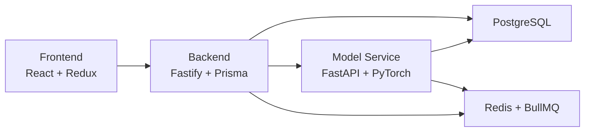

# Welcome to FOVEA Documentation

FOVEA (Flexible Ontology Visual Event Analyzer) is a web-based video annotation tool that enables tactically-oriented analysts to develop annotation ontologies using a persona-based approach.

## Quick Links

- [Installation Guide](./getting-started/installation.md) - Get FOVEA running in 5 minutes
- [Quick Start Tutorial](./getting-started/quick-start.md) - Annotate your first video
- [Architecture Overview](./concepts/architecture.md) - Understand how FOVEA works
- [API Reference](./api-reference/overview.md) - Explore the API documentation

## Key Features

### Persona-Based Ontologies
Different analysts can assign different types to the same real-world objects through their own interpretive frameworks. Learn more in [Personas](./concepts/personas.md).

### Bounding Box Sequences
Support for temporal annotations with keyframe interpolation and automated tracking. See [Annotation System](./concepts/annotation-model.md).

### AI-Powered Analysis
Integrated model service with video summarization, object detection, and tracking. Explore [Model Service](./model-service/overview.md).

### Flexible Deployment
Run on CPU or GPU, locally or in production. Check [Deployment Options](./deployment/overview.md).

## Getting Started

1. **Install** FOVEA using Docker: [Installation Guide](./getting-started/installation.md)
2. **Load** your first video: [Video Management](./getting-started/first-video.md)
3. **Create** annotations with our [User Guides](./user-guides/annotation/creating-annotations.md)
4. **Export** your data: [Export Guide](./user-guides/data-management/exporting-data.md)

## System Architecture

FOVEA consists of three main services:

Learn more about the [architecture](./concepts/architecture.md).

## Need Help?

- [Common Operations](./operations/common-tasks.md) - Frequently needed operations
- [Troubleshooting](./operations/troubleshooting/common-issues.md) - Solutions to common problems
- [GitHub Issues](https://github.com/parafovea/fovea/issues) - Report bugs or request features
